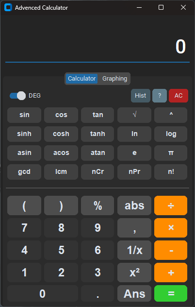
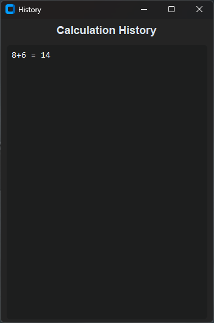
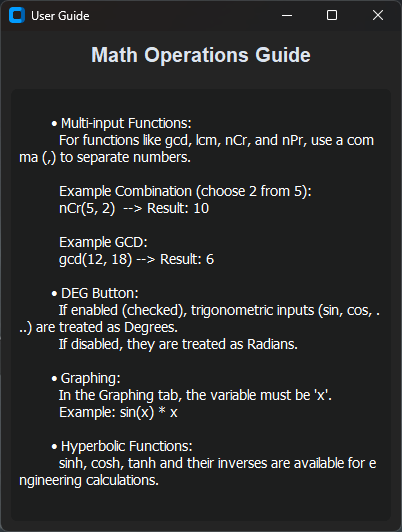
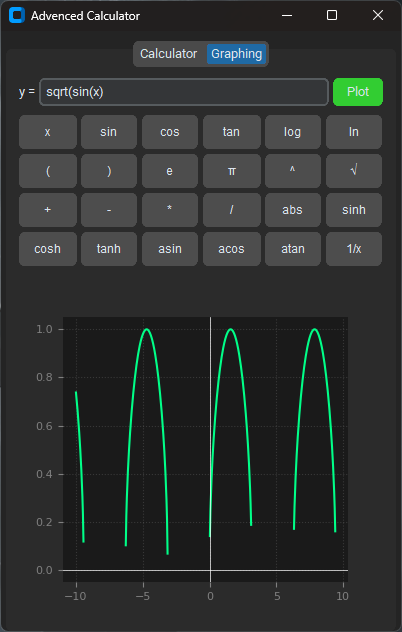

# Advanced Calculator

A powerful, dual-mode scientific and graphing calculator built with Python and CustomTkinter. This application combines a modern dark-themed interface with advanced mathematical capabilities and real-time plotting.



## Description

This project is a desktop calculator application that goes beyond standard arithmetic. It features a tabbed interface separating the **Calculator** and **Graphing** modes. Users can perform complex engineering calculations, number theory operations, and visualize mathematical functions using an integrated Matplotlib backend.

## Key Features

### 🖥️ User Interface

  * **Modern Dark Theme:** Sleek UI powered by CustomTkinter.
  * **Tabbed Navigation:** Seamlessly switch between "Calculator" and "Graphing" modes.
  * **Focus Management:** Smart input handling ensures keyboard typing only affects the active tab.

### 🧮 Advanced Calculator

  * **Standard Operations:** `+`, `-`, `*`, `/`, `%` (Percentage), `abs` (Absolute value).
  * **Scientific Functions:**
      * **Trigonometry:** `sin`, `cos`, `tan` (supports both **Degree** and **Radian** modes via a toggle switch).
      * **Hyperbolic:** `sinh`, `cosh`, `tanh` and their inverse functions (`asin`, `acos`, `atan`).
      * **Logarithms:** `log` (base 10), `ln` (natural log).
      * **Powers & Roots:** Square (`x²`), Cube, Power (`^`), Square Root (`√`), Inverse (`1/x`).
  * **Advanced Math:**
      * **Combinatorics:** `nCr` (Combinations), `nPr` (Permutations), `n!` (Factorial).
      * **Number Theory:** `gcd` (Greatest Common Divisor), `lcm` (Least Common Multiple).
  * **Memory:** `Ans` button to recall the last calculated result.
  * **Smart Logic:**
      * **Auto-Close Parentheses:** Automatically adds missing closing parentheses for faster typing.
      * **History Log:** Dedicated popup window to view past calculations.
        
        
      
      * **Built-in Guide:** Integrated "?" button for usage instructions.
        
        

### 📈 Graphing Engine

  * **Function Plotting:** Visualize mathematical functions (e.g., `sin(x) * x` or `x^2`).
  * **Matplotlib Integration:** High-quality rendering with grid lines and axes.
  * **Helper Buttons:** Quick-insert buttons for variables and functions in the graphing tab to minimize typing errors.



## Requirements

To run this application, you need Python installed along with the following libraries:

  * **CustomTkinter** (UI Framework)
  * **Matplotlib** (Graphing)
  * **Numpy** (Math operations for graphing)

Install them via pip:

```bash
pip install customtkinter matplotlib numpy
