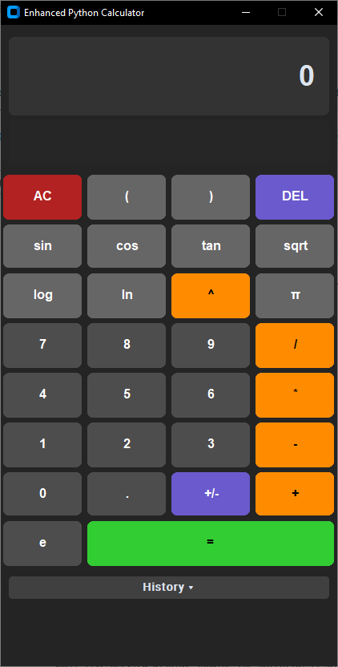

# Python Modern Calculator

A sleek, feature-rich scientific calculator built with Python and the CustomTkinter library, offering a modern dark-themed user interface.



## Description

This project is a desktop calculator application that provides standard arithmetic operations as well as a range of scientific functions. It features a user-friendly interface with a live calculation preview, a collapsible history log, and intuitive input methods including keyboard support and right-click context menus.

## Features

* **Modern UI:** Dark theme powered by CustomTkinter for a contemporary look and feel.
* **Standard Operations:** Addition (`+`), Subtraction (`-`), Multiplication (`*`), Division (`/`).
* **Scientific Functions:**
    * Trigonometry: `sin`, `cos`, `tan` (input in degrees, converted to radians for `math` functions).
    * Logarithms: `log` (base 10), `ln` (natural logarithm).
    * Power and Roots: Exponentiation (`^`), Square Root (`sqrt`).
    * Constants: Pi (`π`), Euler's number (`e`).
* **Input Control:**
    * Parentheses `(` `)` for order of operations.
    * Backspace (`DEL`) for corrections.
    * All Clear (`AC`) to reset the calculator.
    * Toggle sign (`+/-`).
* **Responsive Display:**
    * Large main display for input and results, with auto-adjusting font size for long numbers.
    * Small live preview display showing the potential result of the current expression as you type.
* **Calculation History:**
    * Collapsible history log (toggle with "History ▾/▴" button).
    * Stores up to 50 recent calculations (expression = result).
    * Click on a history entry to copy its result to the clipboard.
* **Copy Functionality:**
    * Right-click on the main display to open a context menu with a "Copy" option.
    * (Note: Ctrl+C shortcut for copying from the main display has been removed as per recent updates).
* **Error Handling:** Displays user-friendly messages for invalid operations (e.g., "Error: Div by 0", "Error: Syntax", "Error: Parentheses").
* **Implicit Multiplication:** Automatically handles cases like `2(3+1)` or `5sin(30)`.
* **Automatic Parentheses Balancing:** Attempts to add missing closing parentheses when `=` is pressed.
* **Keyboard Support:** Most functions are accessible via keyboard shortcuts (see below).

## Requirements

* Python 3.x
* CustomTkinter library
* Tkinter (usually included with standard Python installations)

To install CustomTkinter, run:
```bash
pip install customtkinter
```

## How to Run

1.  Ensure you have Python and the required libraries installed.
2.  Save the calculator code as a Python file (e.g., `modern_calculator.py`).
3.  Open a terminal or command prompt.
4.  Navigate to the directory where you saved the file.
5.  Run the script using:
    ```bash
    python modern_calculator.py
    ```

## Keyboard Shortcuts

* **Numbers:** `0-9`, `.`
* **Operators:** `+`, `-`, `*`, `/`, `^`
* **Parentheses:** `(`, `)`
* **Equals:** `Enter` or `Numpad Enter`
* **All Clear (AC):** `Escape`
* **Delete (DEL):** `Backspace`
* **Functions & Constants:**
    * `s`: sin
    * `c`: cos
    * `t`: tan
    * `l`: log (base 10)
    * `n`: ln (natural log)
    * `q`: sqrt (sQuare root)
    * `p`: π (Pi)
    * `e`: e (Euler's number)
* **Numpad:** Numpad digits and operators (`+`, `-`, `*`, `/`, `.`, `Enter`) are also supported.

## Contributing

Feel free to fork this repository, make improvements, and submit pull requests. For major changes, please open an issue first to discuss what you would like to change.

## License

This project can be considered under the MIT License (or specify your preferred license).

---

*This README provides a template. Feel free to customize it further with more details, screenshots, or specific instructions relevant to your project version.*
